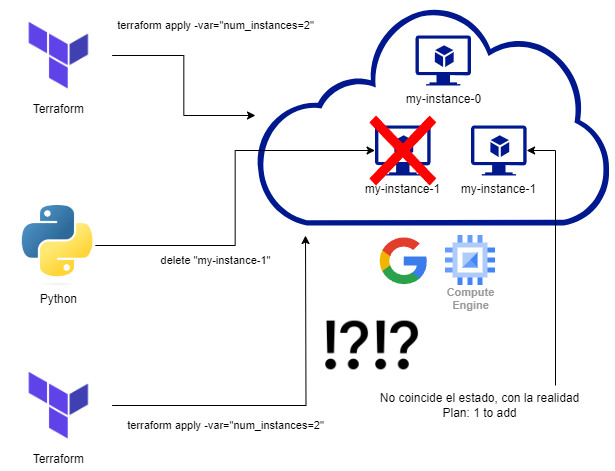

# ¿Qué pasa con el estado de Terraform si se elimina una instancia por fuera de su alcance?

* Cuando se realiza la acción de "delete" en una instancia administrada por Terraform fuera del alcance de Terraform, este no es consciente de estos cambios y su estado no se actualiza automáticamente. Esto puede resultar en una discrepancia entre el estado de Terraform y el estado real de la instancia.

* Al volver a ejecutar terraform plan o terraform apply, Terraform detectará el cambio y propondrá acciones para sincronizar el estado definido en la configuración de Terraform con el estado real de la instancia. Por ejemplo, si en el plan se indicaron crear 2 instancias, y una fue eliminada por fuera, cuando se ejecute de nuevo el plan, propondrá crear una de nuevo.

