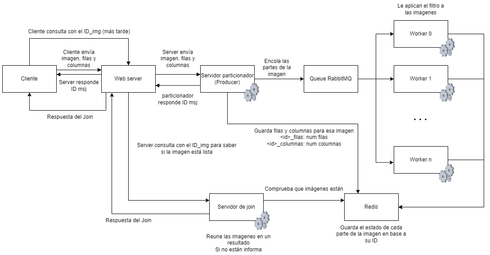

# H1 - PARTE 2
## El operador de Sobel de forma distribuida

Ahora se separan las tareas de forma distribuida mediante contenedores Docker (local):
- Server: recibe una imagen y devuelve un ID, y también puede recibir ese ID para devolver la imagen con el operador sobel aplicado.
- Particionador: El Server le envía la imagen al particionador, este divide la imagen en distintas partes y las encola en RabbitMQ. Además, guarda en Redis la cantidad de filas y de columnas en las que se dividió, para que luego el unificador pueda unir la imagen.
- Workers: Los workers obtienen las partes ya que son consumidores de RabbitMQ, una vez obtenida, le aplican el operador Sobel, y luego la almacenan en un servidor Redis.
- Unificador: Se encarga de obtener las distintas partes de la imagen de Redis, y las vuelve una sola imagen. Cuando el cliente consulta con el ID, el server envía este ID al unificador, y de esta manera comienza la tarea de unificación, luego se la devuelve al server, y el server al cliente.

En la siguiente imagen se puede ver el esquema de trabajo:



Para utilizar esto, primero debe levantar los contenedores (debe tener el ```docker-compose.yml```):
```
docker compose up
```
Luego puede utilziar el ```client.py```. La imagen que envía debe ser .jpg.